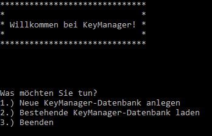
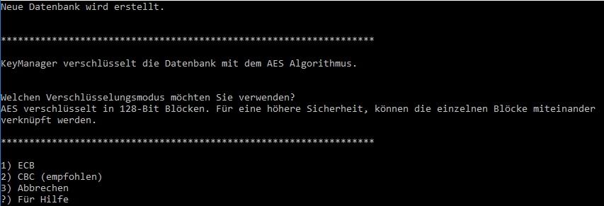
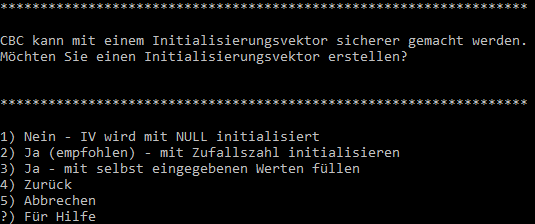
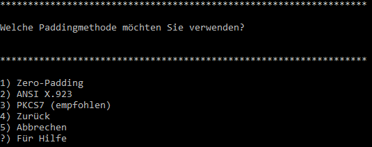
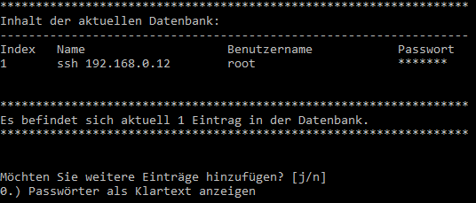
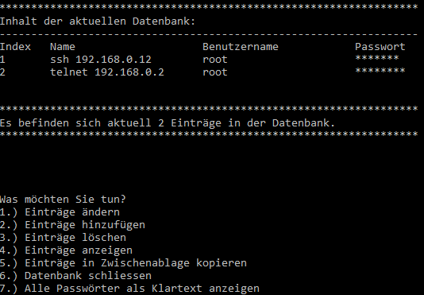

## Key Manager

# Version 1.08
# Created on: 13.07.2016
# Author: Benjamin Leonhardt
# Youtube: https://www.youtube.com/watch?v=_yupK7JyHEg&t=11s

## !!!!!!!!!!!!!!!!!!!!!!!!!!!!!!!!!!!!!!!!!!!!!!!!!!!!!!!!!!!!!!!!!!!!!!!!

Achtung bei diesem Projekt handelt es sich um ein Proof of Concept und sollte 
nicht für die sichere Verwahrung von Kennwörtern verwendet werden!

## !!!!!!!!!!!!!!!!!!!!!!!!!!!!!!!!!!!!!!!!!!!!!!!!!!!!!!!!!!!!!!!!!!!!!!!!

### Was ist KeyManager?

KeyManager ist ein Passwort Tressor. Es hilft Passwörter sicher aufzubewahren
und es können auch sichere zufall Passwörter generiert werden. 
KeyManager verschlüsselt die Datenbank mit dem AES-128-Algorithmus und
ist in der Lage AES mit verschiedenen Modis zu speichern. Bitte verwenden Sie 
für die größt mögliche Sicherheit die empfohlenen Einstellungen.

Der Quellcode ist in C++ geschrieben und kann in der aktuellen Version unter
Windows sowie Linux und unter x86/x64 sowie unter ARM kompiliert werden.

Unter Linux wird die Curses Library benötigt. Diese kann mit 
-> sudo apt-get install libncurses5-dev libncursesw5-dev
installiert werden. Zum kompilieren ist g++ ausreichend.
-> g++ KeyManager.cpp AES.cpp -lncurses -o KeyManager.out -std=c++11

Unter Windows habe ich Microsoft Visual Studio verwendet und sollte dort ohne 
Probleme kompilierbar sein.

Dieses Projekt ist wärhrend meiner Studienzeit entstanden und hat mir geholfen
Verschlüsselung zu verstehen. Der Code steht jedem zur freien Verfügung und 
kann gerne für Studienzwecke verwendet werden.

Im Quellcode ist auskommentiert eine Funktion für eine Brute Force Attacke. 
Diese Funktioniert allerdings nur für den ECB Modus und wurde aus interesse 
implementiert. Da ich die Funktion zu einem sehr frühen stadium implementiert 
habe und mich um das weiterentwickeln dieser nicht gekümmert habe, gebe ich 
auf die Funktion keine gewähr. Ich wollte allerdings ausdrücklich darauf 
hinweisen das diese existiert.

### Anleitung

Nach dem Start wird man mit einem Willkommensbildschirm begrüßt.

  

Hier besteht dir Möglichkeit eine neue Datenbank zu erstellen, eine Datenbank zu laden oder das Programm zu beenden.

Bei Menüwahl 1, also dem Erstellen einer neuen Datenbank, wird man als erstes gefragt, welchen Verschlüsselungsmodus man verwenden möchte. 

  

AES verschlüsselt in 128-Bit-Blöcken. Für eine höhere Sicherheit können die einzelnen Blöcke miteinander verknüpft
werden.

ECB - Electronic Codebook - Hier werden je 128 Bit als ein Block genommen und dieser verschlüsselt. Mehrere Blöcke
werden hintereinander gehängt. Der Nachteil dieses Modus liegt darin dass ein bestimmter Text immer den gleichen
verschlüsselten Text ergibt, wenn er mit demselben Schlüssel verschlüsselt wird.

[ECB Modus Wikipedia]( https://de.wikipedia.org/wiki/Electronic_Code_Book_Mode "ECB Modus Wikipedia")

CBC - Cypher Block Chaining - Hier werden die vorangegangenen Blöcke mit dem verschlüsselten Nachfolgerblock mit einer
XOR-Verknüpfung verbunden. Somit ist der Block durch seine Vorgänger verändert und mit einem zufälligen
Initialisierungsvektor immer anders, auch wenn derselbe Klartext mit demselben Schlüssel verschlüsselt wird.

Nach Auswahl des Punktes 2 also dem CBC Modus, muss die Art wie der Initialisierungsvektor gefüllt werden soll, angegeben werden.

Der Initialisierungsvektor initialisiert die Verschlüsselungskette des CBC Modus.

Bei einem NULL-Initialisierungsvektor bleibt der erste Verschlüsselungsblock immer gleich. Erst darauffolgende Blöcke
werden mit ihren Vorgängern verknüpft. Nachteil: Der erste Block des Chiffrats ist bei gleichem Text und Schlüssel
immer gleich.

Bei einem zufallsgenerierten Initialisierungsvektor wird ein Block zufälliger Daten vorrangestellt. Somit ist der erste Block, der mit Daten gefüllt wird, mit einem Vektor zufälliger Daten verändert. Das Chiffrat ist hier jedes Mal ein
anderes, auch wenn sich Text und Schlüssel nicht ändern.

Für den Initialisierungsvektor mit selbst eingegebenen Werten, gilt das Gleiche, wie bei den Zufallswerten. Diese
sollten möglichst zufällig und jedes Mal anders sein. Diese müssen Sie sich nicht merken, um die Datenbank zu
entschlüsseln.

[Initialisierungsvektor Wikipedia]( https://de.wikipedia.org/wiki/Initialisierungsvektor "Initialisierungsvektor Wikipedia")

Nach Wahl des empfohlenen Menüpunktes 2, muss man sich für ein Paddingverfahren entscheiden.

AES ist eine sogennante Blockchiffre, d.h. zum Verschlüsseln werden immer 128 Bit genommen und verschlüsselt.
Wenn am Ende der Datei nicht mehr genügend Daten vorhanden sind, um einen Block zu füllen, müssen die restlichen Bits
aufgefüllt werden.
Hierfür gibt es verschiedene Standards:

Zero-Padding - Blöcke werden mit Nullwerten gefüllt. Bei 4 nicht gefüllten Bytes werden alle mit Nullen gefüllt
-> 00 00 00 00.

ANSI X.923 - Blöcke werden mit Nullwerten gefüllt. Das letzte Byte zeigt wie viele Bytes mit Padding gefüllt wurden
-> 00 00 00 04.

PKCS7 - Alle Bytes zeigen wie viele Bytes mit Padding gefüllt wurden
-> 04 04 04 04.

[Padding Wikipedia leider nur auf Englisch]( https://en.wikipedia.org/wiki/Padding_(cryptography) "Padding Wikipedia leider nur auf Englisch")

Nach Auswahl des empfohlenen Menüpunktes 2, also dem PKCS7 Standards, ist die Konfiguration der Datenbank beendet. Es muss nun der Pfad und das Masterpasswort für die Datenbank angegeben werden.

Daraufhin muss die Datenbank mit mindestens einem Eintrag gefüllt werden.

Es können nach belieben weitere Einträge hinzugefügt werden.
Nach beendigung der Schleife durch Wahl n, dass keine weiteren Einträge mehr hinzugefügt werden sollen, kommt man ins Hauptmenü.

Im Menüpunt 1, können bestehende Einträge geändert werden.
Im Menüpunt 2, können neue Einträge hinzugefügt werden.
Im Menüpunt 3, können Einträge gelöscht werden.
Im Menüpunt 4, können Einträge angezeigt werden.
Im Menüpunt 5, können Benutzername sowie Passwort in die Zwischenablage kopiert werden. Dies soll dem Nutzer helfen, mit den gespeicherten Einträgen, auch bequem auserhalb des Programms arbeiten zu können.
Im Menüpunt 6, wird die Datenbank geschlossen.
Im Menüpunt 7, können die Passwörter die in der Liste in der oberen Hälfte aufgelistet sind,  in Klartext angezeigt werden. 
